

   
  <b>Limbus Archive</b>

  <a href="https://limbus.shpep.workers.dev"><b>🌐 limbus.shpep.workers.dev</b></a> 
  the website: patch reports, the database and the team builder in a browser, nothing to install

  
  
  
  

A Windows app for poking around Limbus Company's game files: patch datamining, an Identity / E.G.O
database, an enemy handbook, battle animations and skills rendered with the game's own effects,
Versus fights, every asset of the game, a team builder and the soundtrack.

## Website

**[limbus.shpep.workers.dev](https://limbus.shpep.workers.dev)** is a copy of the app that runs in a browser:
patch reports and news, Identities & E.G.O, the enemy handbook, battle animations, the team builder,
the music player, the games and the live streams. The rest (skill renders with effects, Versus,
files) needs the game on your PC, so it is only in the app.

## Features

### Patch reports

After an update you get a list of what changed: new and edited texts, data, images, sounds, and
files the devs shipped early (`nextupdate` and friends). Click a patch to see everything it added.
Korean / Japanese-only lines come with an English machine translation, and **What's new** gives a
short summary ready to paste into Discord or Telegram. **News** shows the developers' weekly
update notices from Steam, each next to its patch in your archive.

<a href="docs/patches.webp">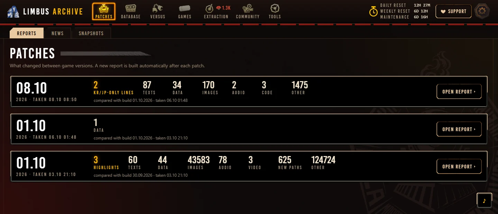</a>

### Identities & E.G.O

A database with skills, passives and stats for every uptie, filters by sin, damage type, status, season
and association. Read straight from the game files, so new Identities show up by themselves after a
patch. Skill icons are shown in their sin frames (by tier, Defense in its own); click one to
save it as a PNG.

<a href="docs/identities.webp">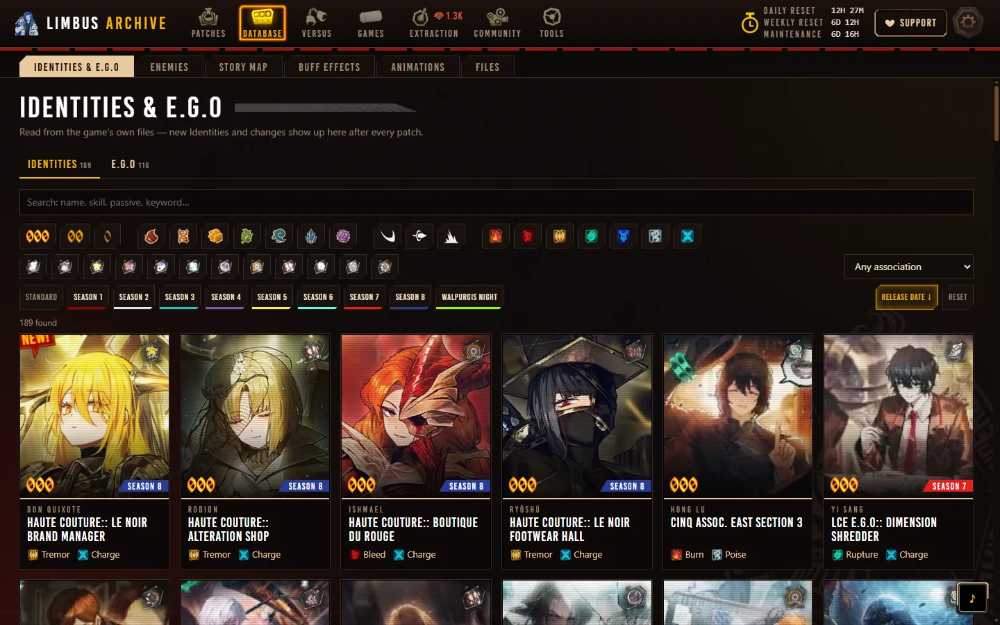</a>

<a href="docs/identity-card.webp">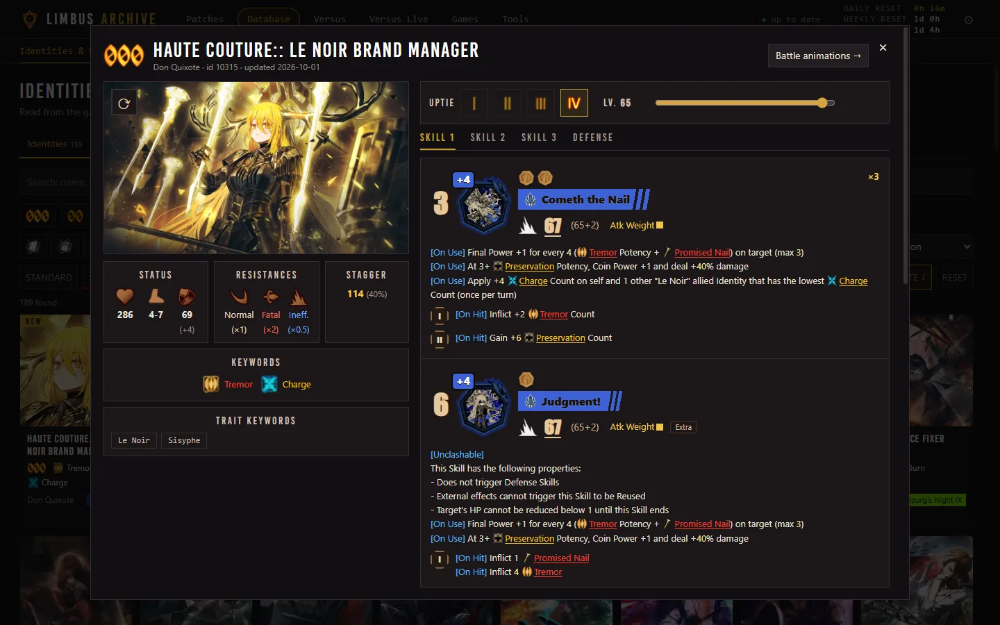</a>

### Enemy handbook

Every enemy, boss and abnormality with its battle look, stats by level, resistances, skills,
passives and the stages it is fought in. Sort by Canto, name, HP, speed or level.

<a href="docs/enemies.webp">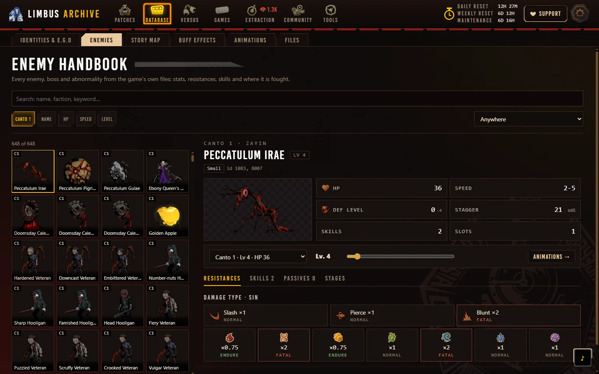</a>

### Story map

Every chapter as the game lays it out: the map with its stage nodes, drag it about and pick a node to
see who is fought there, wave by wave, on which arena and to which battle theme. Dungeons list the
fights inside them. An enemy opens in the handbook, a theme plays in the corner player, and **Play in
Versus** takes the fight's enemy, arena and theme to the Versus page.

<a href="docs/stages.webp">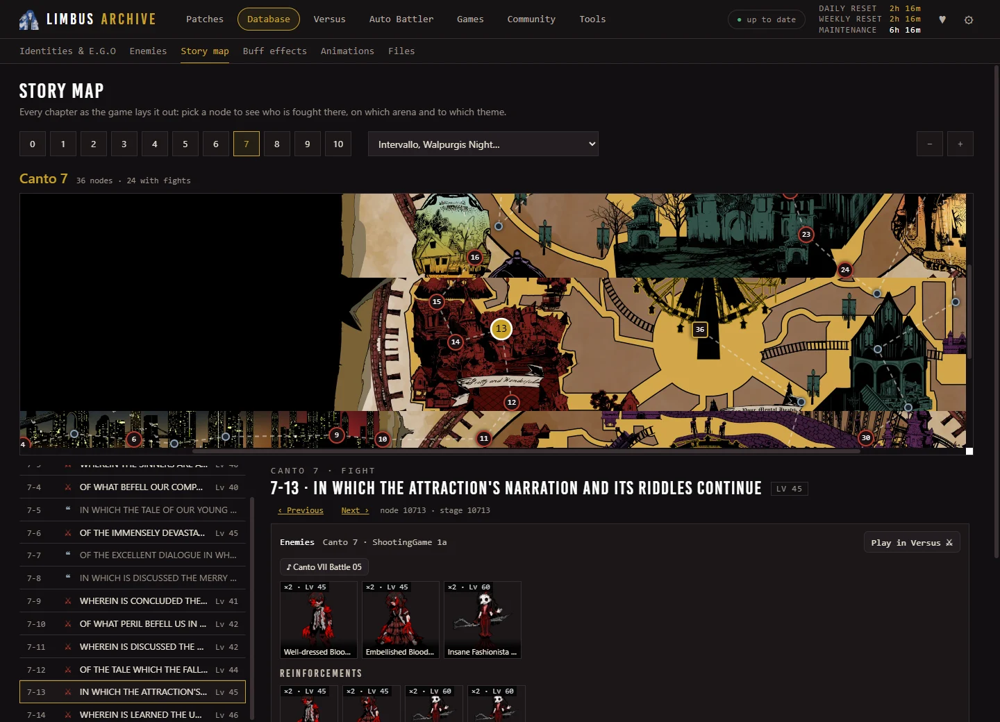</a>

### Buff effects

The buffs and debuffs that have an effect of their own in the game's files (Shin, Prey, the Warden's
nails…), each with a video of the effect and the Identities, E.G.O and enemies that give or get it.
Filter by buff / debuff and by who has it.

<a href="docs/buffs.webp">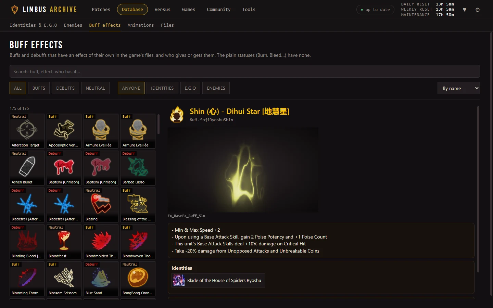</a>

### Animations, skills with effects, mods

- Battle sprites and animations of every Identity, E.G.O and enemy, Spine animations of enemies and
  abnormalities, and the game's own videos.
- **With effects:** skills of Identities, E.G.O (their full cut-in) and enemies rendered to video
  with the game's own effects, shaders, sounds and skill cameras, by a small Unity player that reads
  the game's files. One 1080p video per skill, coins played back to back, with or without a target,
  heads or tails. For editing: a transparent background (WebM with alpha), a static camera, and
  Bloom off.
- **Effects:** each effect of a character on its own, without the characters, on a transparent
  background: skill effects, auras, buff and field effects, in sub-tabs (Skill effects / Auras /
  Battle VFX), each video with its progress bar while it renders. E.G.O cut-ins play their promotion_After
  version, the one of the trailers.
- **Edit:** redraw a skill's frames (download them one PNG per frame, load back the ones you
  changed; any size, placed by the feet), take frames from another character, add freeze frames or
  slow-motion, recolour the effects, or replace whole sprite sheets, then render again. Applied only
  while rendering: the game's files stay as they are.

<a href="docs/animations.webp">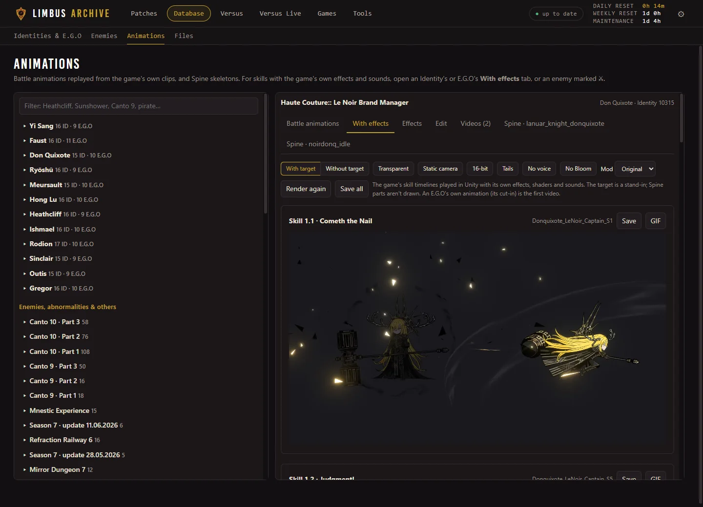</a>

### Versus

Any Identity, E.G.O or enemy against any other on one stage: one takes the other's skill with its
own idle and hit poses, or both clash first (their clash animations at once, as many rounds as you
like) and the winner's skill follows. Optional HP and damage numbers, a death finale, an intro card
and WIN, an E.G.O cut-in and battle music.

**Versus Live** plays such a fight as it happens, in the renderer's own window: press START for two random
fighters on a random stage (or the Versus page's picks), with the fight's sounds, music, intro card and WIN.
Nothing is saved.

**Online room** (pick and fight): make a room and send its code. Two players each pick a fighter and
its last skill in secret; at the host's Start the same fight plays on everybody's screen in Versus
Live. The others in the room watch and may bet lunacy on a side. Everybody needs the app.

<a href="docs/versus.webp">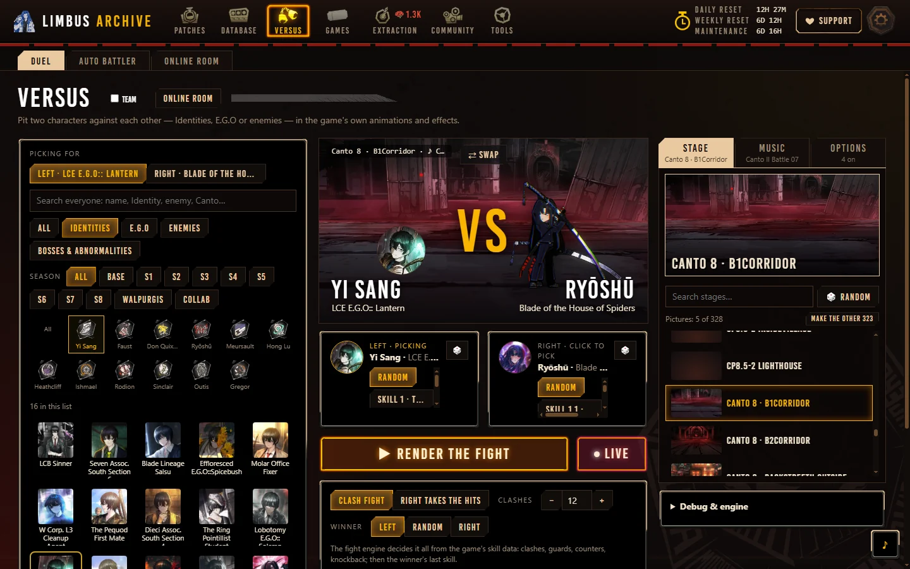</a>

### Files

Every asset in the game, like in AssetRipper: catalog paths and files of the install, with preview
and export (PNG, JSON, WAV, MP4).

<a href="docs/browse.webp">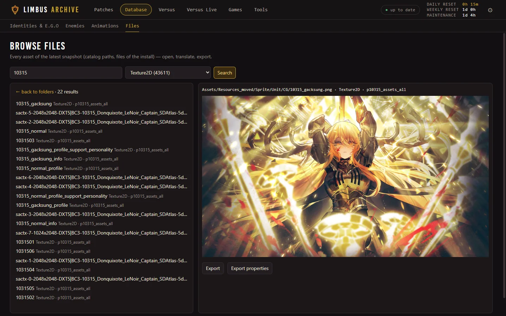</a>

### Team builder

Pick an Identity per Sinner and an order. Teams from the
[MDOT Mirror Dungeon guide](https://docs.google.com/spreadsheets/d/1PGbgzl4Z2plWIJD5_2ZdVyfkpPvCUYPK_AJq2q6Ij5c)
show up as a recommended tier list; the app re-reads the guide once a week.

<a href="docs/team-builder.webp">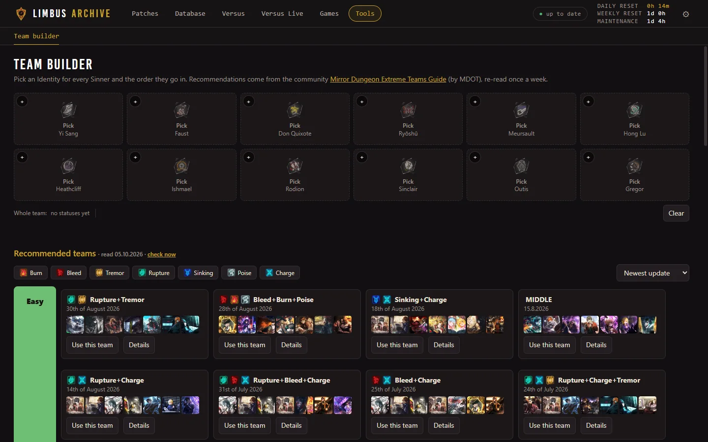</a>

### Music player

A small player in the corner with the game's own soundtrack, read from its sound files: battle themes first,
under their official names, with the Canto and the boss a theme belongs to. Search by track, Canto or enemy.

<a href="docs/music.webp">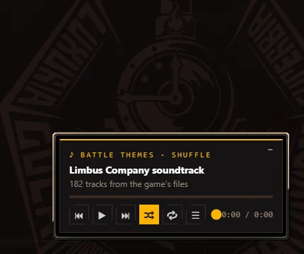</a>

### Games

Guessing games, ten rounds each, Easy with four answers or Hard typing the name; hints cost
points. Puzzles. And two toys.

- **Guess the track:** a piece of the soundtrack plays from a random spot, and the sooner you name it
  the more it is worth. Also backwards, sped up, or with another track over it.
- **Guess the Identity:** a voice line of an Identity or a boss, by ear or by its text.
- **Guess the character:** a voiced line from the story — who says it?
- **Guess the skill:** a skill's picture — whose skill is it?
- **Guess the enemy:** a black silhouette that opens in steps; or an Identity in big pixels.
- **Guess the Canto:** a piece of a background from the story that zooms out.
- **Guess the art:** the same over the art of Identities and E.G.O.
- **In pieces:** an Identity's moving art as the game keeps it — cut into parts on a sheet; the
  parts come in steps.
- **Odd one out:** four Identities, three with something in common — find the fourth and say what
  the others share.
- **Limbus Wordle:** one hidden Identity, eight tries; each try shows what it shares with the hidden
  one — Sinner, season, rarity, archetype, damage, faction.
- **Connections:** sixteen Identities, four groups of four with something in common.
- **Limbus Grid:** a 3 × 3 grid with a condition on every row and column — name an Identity for
  each cell, nine tries.
- **Chain:** from one Identity to another, each step sharing the Sinner or a faction with the one
  before — in the fewest links.
- **Jigsaw:** an Identity's art cut into tiles and shuffled — put it together against the clock.
- **Mixed up:** a piece of a track cut into parts and shuffled — listen and put them back in order.
- **Guess the buff:** the effect of a buff or a debuff plays — which one is it?
- **Extraction** (a toy): the game's own extraction — its banners with their real pools and chances,
  the orb in chains, every 000 and E.G.O shown with its line and voice, the ten cards. All of it with
  the game's pictures and sounds.
- **Challenge roulette** (a toy): a random team and a rule to play it by.

**Daily challenge:** the same game for everybody, new at the game's daily reset; the result copies
as a line of squares to share.

**Duel:** the same rounds for you and a friend. *By link* — the invite is there from the first round;
send it, each plays in their own time, and the result page's link carries the result to beat. *Live* —
a room for two to eight under nicknames, everybody at once: a **race** (each at their own pace) or
**first to answer** (rounds in step, the first right answer takes the round). Live needs the website.

**Lunacy:** the games pay it — a finished game, a Daily, days in a row, a duel won, eighteen
achievements — and Extraction spends it.

<a href="docs/games.webp">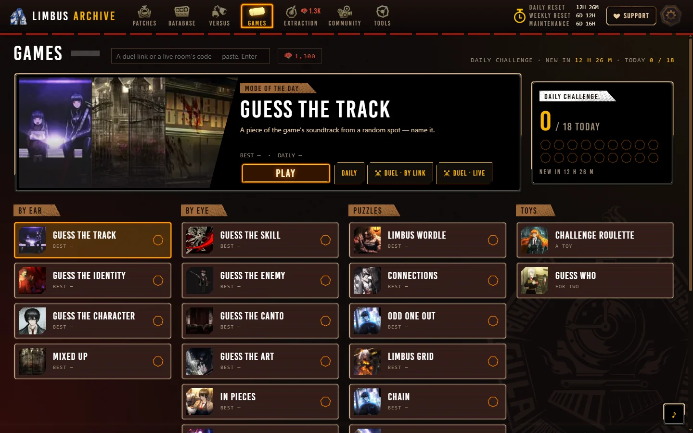</a>

### Community

Who streams Limbus Company right now on Twitch and YouTube: English, Russian and Korean streams,
sorted by viewers, by start or by how long they have been live. While a big stream is on, the menu
button shows who it is.

<a href="docs/community.webp">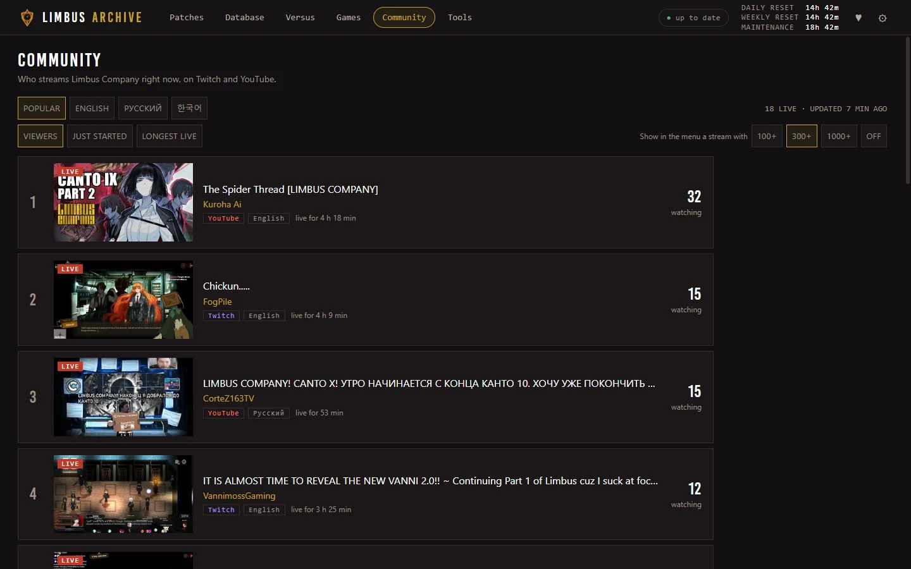</a>

Also: reset timers (daily, weekly, maintenance) at the top and a list of your snapshots.

## Requirements

- Windows 10 or 11, 64-bit.
- Limbus Company installed through **Steam** (the app finds it by itself in any Steam library).
- About 1 GB of free disk for the app's data (more if you render a lot of videos), and up to ~6 GB
  of RAM while the first snapshot is built.
- A graphics card for the skill renders (they run in Unity).
- [WebView2 Runtime](https://developer.microsoft.com/microsoft-edge/webview2/) (already there on
  Windows 11 and an updated Windows 10).
- Internet for some parts: Spine animations (the player loads from a CDN), translations of
  Korean / Japanese lines and the team guide.

Nothing else to install: Python, FFmpeg and the Unity player are inside the zip.

The app reads the game's files on your PC. It doesn't touch the running game or its servers.

## Install

1. Grab `LimbusArchive.zip` from [Releases](../../releases) and unzip it into a folder with free
   space (not Program Files): the app keeps its data in `data\` next to the exe.
2. Update the game, then run `LimbusArchive.exe`. If SmartScreen complains, click
   **More info → Run anyway**.
3. Hit **Take first snapshot** (about 10 minutes the first time).

After each patch, open the game so it downloads everything. The app notices the new version by
itself (on start, or within a couple of minutes if it's open) and builds the report. It also tells
you when a new version of the app is out; install it from the status button at the top.

## Build

Install [uv](https://docs.astral.sh/uv/) and run `build.ps1` (it sets up Python 3.12 and the
dependencies). The skill renderer (a Unity player) is not part of this repository; without it the
app is built without the renders with effects — take the `LimbusViewer` folder from a release zip
and put it next to the built exe to have them.

## Thanks

[UnityPy](https://github.com/K0lb3/UnityPy), [fmod_toolkit](https://github.com/K0lb3/fmod_toolkit),
[pywebview](https://pywebview.flowrl.com/), [FFmpeg](https://ffmpeg.org/),
[Unity](https://unity.com/), [Spine](https://esotericsoftware.com/) (its web player is loaded
from a CDN). Team recommendations by MDOT.

## License

MIT. Not affiliated with Project Moon; the game's assets belong to them.
